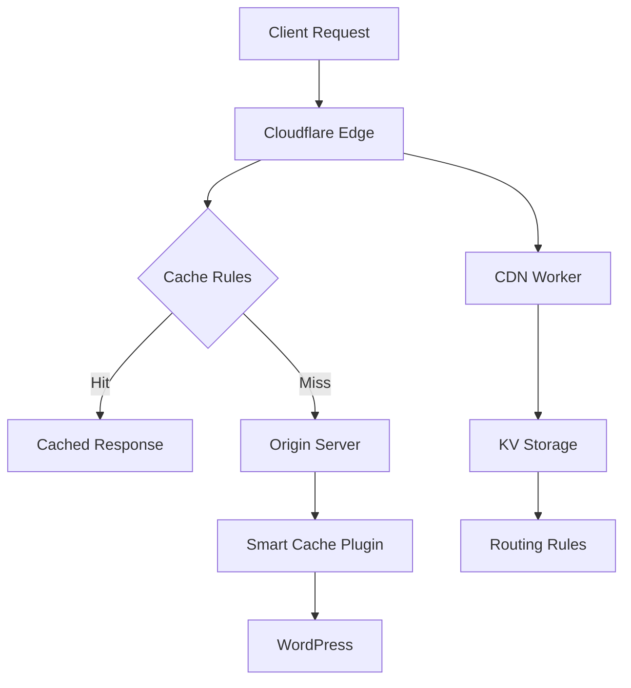

# Cloudflare Smart Tools

> Modular suite for advanced Cloudflare cache management, edge caching, and flexible CDN routing for modern web applications.


---

## 🚀 Overview

Cloudflare Smart Tools is a comprehensive, modular toolkit for optimizing Cloudflare cache, edge performance, and CDN routing. It includes:
- **CF Bypass Cache**: Copy-paste friendly cache bypass rules for WordPress, Laravel, ASP.NET, and generic web apps.
- **CF Smart Cache**: Powerful WordPress plugin for edge HTML caching, automatic purging, admin controls, API token support, and logging.
- **CF Smart CDN Workers**: KV-based Cloudflare Worker for dynamic CDN routing (deprecated worker code included for reference).

Whether you run a WordPress site, a modern web app, or need advanced CDN logic, this suite provides flexible, production-ready solutions.

---

## 📦 Modules

### 🛡️ CF Bypass Cache
- **Purpose**: Ensures dynamic/admin content is always fresh by bypassing Cloudflare cache for authenticated users and admin areas.
- **Features**:
  - Ready-to-use rules for WordPress, Laravel, ASP.NET, and generic apps
  - Copy-paste blocks for Cloudflare expression builder
  - Markdown documentation for each rule set
- **How to Use**:
  1. Browse [`cf-bypass-cache`](cf-bypass-cache/) and its `.md` docs
  2. Copy the rule block for your framework
  3. Paste into Cloudflare's Cache/Page Rules expression builder
  4. Adjust as needed for your environment
- **Documentation**: [cf-bypass-cache.md](website/modules/cf-bypass-cache.md)

### ⚡ CF Smart Cache
- **Purpose**: Enterprise-grade WordPress plugin for edge HTML caching via Cloudflare, with smart purging and admin tools.
- **Features**:
  - Edge HTML caching (Cloudflare Worker integration)
  - Automatic purging on post/category/comment changes
  - Admin dashboard, toolbar, and manual controls
  - API token authentication, batch/rate limiting
  - Logging, analytics, and security headers
- **How to Use**:
  1. Download/copy [`cf-smart-cache`](cf-smart-cache/) to your WordPress `wp-content/plugins` directory
  2. Activate in WordPress admin
  3. Configure Cloudflare API Token/Key and Zone ID in plugin settings
  4. (Optional) Set bypass cookie prefixes for Worker integration
- **Documentation**: [cf-smart-cache.md](website/modules/cf-smart-cache.md)

### 🌐 CF Smart CDN Workers
- **Purpose**: Advanced Cloudflare Worker for dynamic CDN proxying and routing using KV storage
- **Features**:
  - Dynamic CDN proxying
  - KV-based routing rules
  - Geographic and custom header routing
  - Load balancing and edge optimization
- **Status**: Worker code is **deprecated**; see [`cf-smart-cache-workers`](cf-smart-cache-workers/) and [DEPRECATED.md](cf-smart-cache-workers/DEPRECATED.md) for migration guidance.

---

## 🛠️ Quick Start

### For Cache Bypass Rules
1. Browse [cf-bypass-cache](cf-bypass-cache/) and documentation
2. Copy the relevant `.rules` block
3. Paste into Cloudflare dashboard

### For WordPress Sites
1. Download/copy [cf-smart-cache](cf-smart-cache/) plugin
2. Install and activate in WordPress
3. Configure with Cloudflare API credentials

### For Advanced CDN Routing
1. Deploy worker from [cf-smart-cache-workers](cf-smart-cache-workers/) (deprecated)
2. Configure KV namespace and routing rules as needed

---

## 🏗️ Architecture



---

## 🌟 Features

- Modular design: use only what you need
- High performance: edge caching and CDN optimization
- Easy configuration: copy-paste setup
- Comprehensive logging and analytics
- Security-focused: API token, headers, bypass logic
- Mobile and global CDN optimized

---

## 🛠️ Prerequisites

- Cloudflare account (free or paid)
- API Token or Global API Key
- For WordPress plugin: PHP 7.4+, WordPress 5.0+
- For Workers: Cloudflare Workers subscription (KV optional)

---

## ⚙️ Installation & Setup

### Clone the Repository
```sh
git clone https://github.com/LoveDoLove/cloudflare-smart-tools.git
```

### WordPress Plugin
- Copy `cf-smart-cache` to `wp-content/plugins/`
- Activate in WordPress admin
- Enter Cloudflare API Token/Key and Zone ID in settings
- (Optional) Configure bypass cookie prefixes

### Cache Bypass Rules
- Copy rules from `cf-bypass-cache/*.md` docs
- Paste into Cloudflare dashboard (Cache/Page Rules)

### CDN Worker (Deprecated)
- See `cf-smart-cache-workers/DEPRECATED.md` for migration guidance

---

## 🚀 Usage

- Automatic cache purging on content changes (WordPress plugin)
- Manual cache controls via admin dashboard
- Advanced admin toolbar integration
- Monitor logs and analytics
- Use bypass rules for dynamic/admin content freshness
- Deploy CDN worker for advanced routing (legacy)

---

## 📈 Performance Benefits

| Metric                | Improvement         |
|-----------------------|--------------------|
| Page Load Time        | Up to 70% faster   |
| Time to First Byte    | Reduced by 80%     |
| Server Load           | Decreased by 60%   |
| Bandwidth Usage       | Optimized by 50%   |
| Global Availability   | 99.9% uptime       |

---

## 🤝 Contributing

We welcome contributions! How to help:
1. Report issues: [GitHub Issues](https://github.com/LoveDoLove/cloudflare-smart-tools/issues)
2. Feature requests: [GitHub Issues](https://github.com/LoveDoLove/cloudflare-smart-tools/issues)
3. Fork, develop, and submit a PR
4. Help improve documentation

### Development Setup
```sh
git clone https://github.com/LoveDoLove/cloudflare-smart-tools.git
cd cloudflare-smart-tools
# Choose your module and start developing!
```

---

## 🗺️ Roadmap
- [x] Modular cache bypass rules
- [x] WordPress edge HTML caching plugin
- [x] KV-based CDN proxy worker
- [x] Comprehensive documentation
- [ ] REST API for cache management
- [ ] Advanced analytics dashboard
- [ ] Visual rule management UI
- [ ] Multi-language support
- [ ] Enterprise features

---

## 📜 License

This project is licensed under the MIT License - see the [LICENSE](LICENSE) file for details.

---

## 🙏 Acknowledgments
- [Cloudflare](https://cloudflare.com) for their platform
- [WordPress Community](https://wordpress.org)
- [Open Source Contributors](https://github.com/LoveDoLove/cloudflare-smart-tools/graphs/contributors)
- [Best README Template](https://github.com/othneildrew/Best-README-Template)

---

## 📞 Support
- [GitHub Discussions](https://github.com/LoveDoLove/cloudflare-smart-tools/discussions)
- [Bug Reports](https://github.com/LoveDoLove/cloudflare-smart-tools/issues)
- [Documentation](https://lovedolove.github.io/cloudflare-smart-tools/)

---

<div align="center">

**Made with ❤️ by [LoveDoLove](https://github.com/LoveDoLove)**

[⭐ Star this project](https://github.com/LoveDoLove/cloudflare-smart-tools) if you find it useful!

</div>
