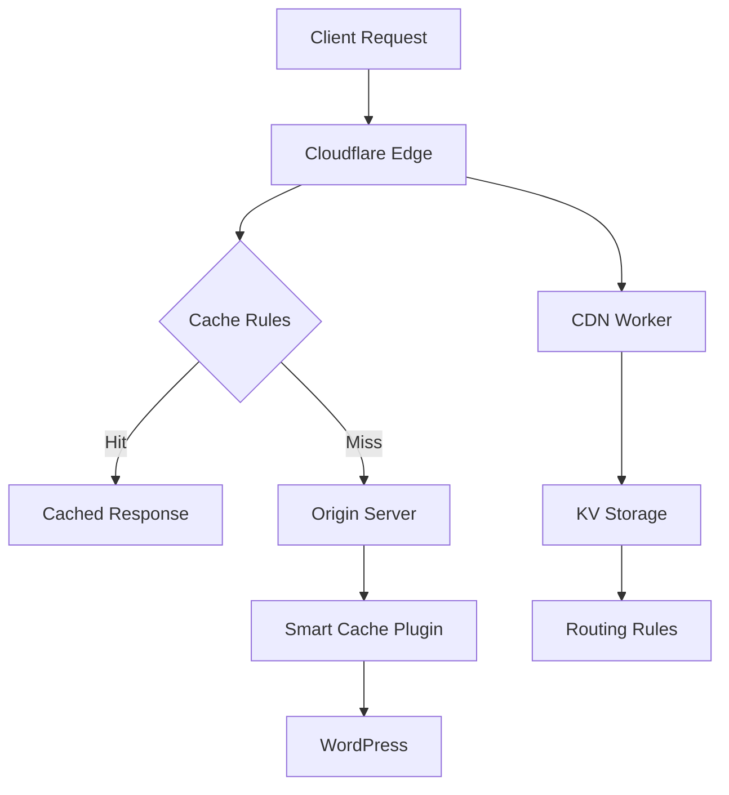

# Cloudflare Smart Tools

> Modular suite for advanced Cloudflare cache management, edge caching, and flexible CDN routing for modern web applications.


## 🚀 Overview

Cloudflare Smart Tools is a comprehensive collection of modules designed to supercharge your Cloudflare setup with advanced caching strategies, edge optimization, and intelligent CDN routing. Whether you're running a WordPress site, building a modern web application, or managing complex CDN requirements, our tools provide the flexibility and power you need.

## 📦 Modules

### 🛡️ CF Bypass Cache
**Copy-paste friendly Cloudflare cache bypass rules**

Perfect for ensuring dynamic content freshness across different platforms and frameworks.

- ✅ WordPress optimized rules
- ✅ Laravel framework support  
- ✅ ASP.NET compatibility
- ✅ Generic web application rules
- ✅ Ready-to-use rule sets

[📖 Documentation](modules/cf-bypass-cache.md) | [🔗 View Rules](https://github.com/LoveDoLove/cloudflare-smart-tools/tree/main/cf-bypass-cache)

### ⚡ CF Smart Cache
**WordPress plugin for intelligent edge HTML caching**

A powerful WordPress plugin that brings enterprise-level caching capabilities to your site.

- ✅ Edge HTML caching
- ✅ Automatic cache purging
- ✅ Advanced admin controls
- ✅ API token support
- ✅ Comprehensive logging
- ✅ WordPress 5.0+ compatible

[📖 Documentation](modules/cf-smart-cache.md) | [⬇️ Download Plugin](https://github.com/LoveDoLove/cloudflare-smart-tools/tree/main/cf-smart-cache)

### 🌐 CF Smart CDN Workers
**KV-based Cloudflare Worker for dynamic CDN routing**

Advanced CDN proxy worker with intelligent routing capabilities using Cloudflare KV storage.

- ✅ Dynamic CDN proxying
- ✅ KV-based routing rules
- ✅ Geographic routing support
- ✅ Load balancing capabilities
- ✅ Custom header management
- ✅ Edge computing optimization

[📖 Documentation](modules/cf-smart-cdn-workers.md) | [🚀 Deploy Worker](https://github.com/LoveDoLove/cloudflare-smart-tools/tree/main/cf-smart-cdn-workers)

### 📦 CF Smart Cache Workers (Deprecated)
Legacy worker code for reference and migration purposes.

[📖 Deprecation Notice](modules/cf-smart-cache-workers.md)

## 🎯 Quick Start

Choose the module that best fits your needs:

### For Cache Bypass Rules
1. Browse the [cache bypass rules](modules/cf-bypass-cache.md)
2. Copy the appropriate `.rules` file content
3. Paste into your Cloudflare dashboard

### For WordPress Sites
1. Download the [Smart Cache plugin](modules/cf-smart-cache.md)
2. Install and activate in WordPress
3. Configure with your Cloudflare API credentials

### For Advanced CDN Routing
1. Deploy the [CDN Worker](modules/cf-smart-cdn-workers.md)
2. Configure KV namespace
3. Set up routing rules

## 🛠️ Prerequisites

- **Cloudflare Account**: Free or paid plan
- **API Access**: Cloudflare API token or Global API key
- **For WordPress Plugin**: PHP 7.4+, WordPress 5.0+
- **For Workers**: Cloudflare Workers subscription (optional KV storage)

## 🏗️ Architecture



## 🌟 Features

- **🎯 Modular Design**: Use only what you need
- **⚡ High Performance**: Optimized for edge computing
- **🔧 Easy Configuration**: Copy-paste friendly setup
- **📊 Comprehensive Logging**: Track performance and issues
- **🌍 Global CDN**: Leverage Cloudflare's worldwide network
- **🔒 Security Focused**: Built with security best practices
- **📱 Mobile Optimized**: Responsive and fast on all devices

## 📈 Performance Benefits

| Metric | Improvement |
|--------|------------|
| **Page Load Time** | Up to 70% faster |
| **Time to First Byte** | Reduced by 80% |
| **Server Load** | Decreased by 60% |
| **Bandwidth Usage** | Optimized by 50% |
| **Global Availability** | 99.9% uptime |

## 🤝 Contributing

We welcome contributions! Here's how you can help:

1. **🐛 Report Issues**: Found a bug? [Create an issue](https://github.com/LoveDoLove/cloudflare-smart-tools/issues)
2. **💡 Feature Requests**: Have an idea? [Share it with us](https://github.com/LoveDoLove/cloudflare-smart-tools/issues)
3. **🔧 Code Contributions**: Fork, develop, and submit a PR
4. **📖 Documentation**: Help improve our docs

### Development Setup

```bash
# Clone the repository
git clone https://github.com/LoveDoLove/cloudflare-smart-tools.git

# Navigate to project directory
cd cloudflare-smart-tools

# Choose your module and start developing!
```

## 🗺️ Roadmap

- [x] **Modular cache bypass rules**
- [x] **WordPress edge HTML caching plugin**
- [x] **KV-based CDN proxy worker**
- [x] **Comprehensive documentation**
- [ ] **REST API for cache management**
- [ ] **Advanced analytics dashboard**
- [ ] **Visual rule management UI**
- [ ] **Multi-language support**
- [ ] **Enterprise features**

## 📜 License

This project is licensed under the MIT License - see the [LICENSE](https://github.com/LoveDoLove/cloudflare-smart-tools/blob/main/LICENSE) file for details.

## 🙏 Acknowledgments

- [Cloudflare](https://cloudflare.com) for their amazing platform
- [WordPress Community](https://wordpress.org) for continuous inspiration
- [Open Source Contributors](https://github.com/LoveDoLove/cloudflare-smart-tools/graphs/contributors) for their valuable contributions

## 📞 Support

- **📧 Email**: [Contact Us](mailto:support@example.com)
- **💬 Discussions**: [GitHub Discussions](https://github.com/LoveDoLove/cloudflare-smart-tools/discussions)
- **🐛 Issues**: [Bug Reports](https://github.com/LoveDoLove/cloudflare-smart-tools/issues)
- **📖 Documentation**: [Full Documentation](https://lovedolove.github.io/cloudflare-smart-tools/)

---

<div align="center">

**Made with ❤️ by [LoveDoLove](https://github.com/LoveDoLove)**

[⭐ Star this project](https://github.com/LoveDoLove/cloudflare-smart-tools) if you find it useful!

</div>
