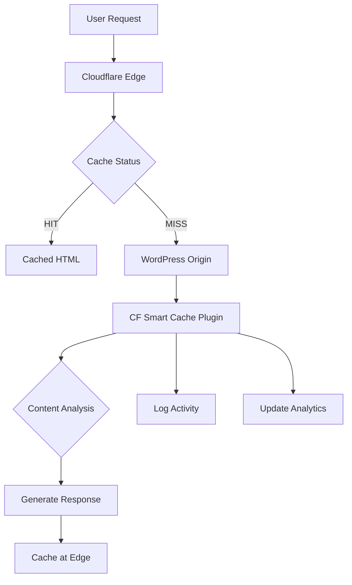

# ⚡ CF Smart Cache

> Powerful all-in-one Cloudflare cache solution for WordPress: edge HTML caching, automatic purging, advanced admin controls, API token support, and comprehensive logging.

## Overview

CF Smart Cache is a sophisticated WordPress plugin that transforms your website's performance by implementing intelligent edge HTML caching through Cloudflare. Unlike traditional caching plugins, CF Smart Cache works at the edge level, ensuring lightning-fast delivery of your content from Cloudflare's global network while maintaining dynamic functionality where needed.

## 🎯 Key Features

### ⚡ Edge HTML Caching

- **Edge-level caching** for maximum performance
- **Intelligent cache management** with automatic purging
- **Selective caching** based on content types and user roles
- **Global CDN delivery** through Cloudflare's network

### 🔄 Automatic Cache Purging

- **Smart purging** on content updates
- **Dependency tracking** (posts, categories, tags)
- **Bulk operations** support
- **Scheduled purging** capabilities

### 🛡️ Advanced Security

- **API Token authentication** (recommended)
- **Global API Key support** (legacy)
- **Secure credential storage**
- **Permission-based access control**

### 📊 Comprehensive Logging

- **Detailed operation logs**
- **Performance metrics**
- **Error tracking and debugging**
- **Cache analytics dashboard**

### 🎛️ Admin Controls

- **Intuitive dashboard interface**
- **One-click cache operations**
- **Bulk cache management**
- **Real-time status monitoring**

## 🏗️ Architecture



## 📦 Installation

### Method 1: Manual Installation

1. **Download the Plugin**

   ```bash
   git clone https://github.com/LoveDoLove/cloudflare-smart-tools.git
   cd cloudflare-smart-tools
   ```

2. **Copy to WordPress**

   ```bash
   cp -r cf-smart-cache /path/to/wordpress/wp-content/plugins/
   ```

3. **Activate the Plugin**
   - Go to **WordPress Admin** → **Plugins**
   - Find **"CF Smart Cache"**
   - Click **"Activate"**

### Method 2: WordPress Admin Upload

1. Download the plugin zip file
2. Go to **WordPress Admin** → **Plugins** → **Add New**
3. Click **"Upload Plugin"**
4. Select the zip file and click **"Install Now"**
5. Activate the plugin

## ⚙️ Configuration

### Step 1: Cloudflare API Setup

#### Option A: API Token (Recommended)

1. Go to [Cloudflare API Tokens](https://dash.cloudflare.com/profile/api-tokens)
2. Click **"Create Token"**
3. Use the **"Zone:Cache Purge"** template
4. Select your zone and permissions:
   - **Zone:Cache Purge** - Edit
   - **Zone:Zone** - Read
5. Copy the generated token

#### Option B: Global API Key (Legacy)

1. Go to [Cloudflare API Keys](https://dash.cloudflare.com/profile/api-tokens)
2. Copy your **Global API Key**
3. Note your account email address

### Step 2: Plugin Configuration

1. **Access Plugin Settings**

   - Go to **WordPress Admin** → **Settings** → **CF Smart Cache**

2. **Basic Configuration**

   ```
   Cloudflare Email: your-email@example.com (if using Global API Key)
   API Token/Key: your-api-token-or-global-key
   Zone ID: your-cloudflare-zone-id
   ```

3. **Advanced Settings**
   ```
   Cache TTL: 86400 (24 hours)
   Purge Method: Individual URLs (recommended)
   Bypass Cookies: wordpress_logged_in_,wp-postpass_,comment_author_
   Debug Mode: Enable for troubleshooting
   ```

### Step 3: Verification

1. **Test Cache Purging**

   - Edit and update a post
   - Check plugin logs for successful purge operations

2. **Verify Edge Caching**
   - Visit your site and check response headers
   - Look for `cf-cache-status: HIT` on subsequent visits

## 🚀 Usage Guide

### Dashboard Overview

The CF Smart Cache dashboard provides comprehensive control over your caching operations:

#### Cache Status Widget

- **Current cache status** across your site
- **Real-time hit/miss ratios**
- **Total cached pages** count
- **Last purge activity** timestamp

#### Quick Actions

- **🔄 Purge All Cache** - Clear entire site cache
- **🎯 Purge Single URL** - Clear specific page cache
- **📊 View Analytics** - Access detailed performance metrics
- **🔧 Test Connection** - Verify Cloudflare API connectivity

### Automatic Purging

CF Smart Cache automatically purges cache when:

#### Content Updates

- **Post published/updated** → Purges post page, homepage, category, and tag pages
- **Comment approved** → Purges post page and related archives
- **Category/tag modified** → Purges taxonomy pages and affected posts
- **Menu changes** → Purges pages using the modified menu

#### User Actions

- **Theme switched** → Purges entire cache
- **Plugin activated/deactivated** → Purges entire cache
- **Widget updated** → Purges affected pages

### Manual Cache Management

#### Bulk Operations

```php
// Purge multiple URLs
$urls = [
    'https://example.com/',
    'https://example.com/about/',
    'https://example.com/contact/'
];
cf_smart_cache_purge_urls($urls);
```

#### Selective Purging

```php
// Purge by post ID
cf_smart_cache_purge_post(123);

// Purge by category
cf_smart_cache_purge_category(5);

// Purge by tag
cf_smart_cache_purge_tag(10);
```

## 🔧 Advanced Configuration

### Custom Cache Rules

#### Exclude Specific Pages

```php
// In your theme's functions.php
add_filter('cf_smart_cache_exclude_urls', function($excluded_urls) {
    $excluded_urls[] = '/my-dynamic-page/';
    $excluded_urls[] = '/real-time-data/';
    return $excluded_urls;
});
```

#### Custom Cache TTL

```php
// Set different TTL for different content types
add_filter('cf_smart_cache_ttl', function($ttl, $post_type) {
    if ($post_type === 'product') {
        return 3600; // 1 hour for products
    }
    if ($post_type === 'news') {
        return 1800; // 30 minutes for news
    }
    return $ttl; // Default TTL
}, 10, 2);
```

### Integration with Cloudflare Workers

#### Worker Script Example

```javascript
// Cloudflare Worker for advanced caching logic
addEventListener("fetch", (event) => {
  event.respondWith(handleRequest(event.request));
});

async function handleRequest(request) {
  const url = new URL(request.url);

  // Check for bypass cookies
  const bypassCookies = [
    "wordpress_logged_in_",
    "wp-postpass_",
    "comment_author_",
  ];
  const cookies = request.headers.get("Cookie") || "";

  for (const bypassCookie of bypassCookies) {
    if (cookies.includes(bypassCookie)) {
      // Bypass cache for logged-in users
      return fetch(request);
    }
  }

  // Cache for anonymous users
  const cacheKey = new Request(url, request);
  const cache = caches.default;

  let response = await cache.match(cacheKey);
  if (!response) {
    response = await fetch(request);

    // Cache successful responses
    if (response.status === 200) {
      const cacheResponse = response.clone();
      event.waitUntil(cache.put(cacheKey, cacheResponse));
    }
  }

  return response;
}
```

### Database Optimization

#### Cache Analytics Table

The plugin creates a custom table for analytics:

```sql
CREATE TABLE wp_cf_smart_cache_analytics (
  id bigint(20) NOT NULL AUTO_INCREMENT,
  url varchar(255) NOT NULL,
  action varchar(50) NOT NULL,
  timestamp datetime NOT NULL,
  response_code int(11) DEFAULT NULL,
  cache_status varchar(20) DEFAULT NULL,
  PRIMARY KEY (id),
  KEY url_index (url),
  KEY timestamp_index (timestamp)
);
```

## 📊 Performance Monitoring

### Key Metrics Dashboard

#### Cache Performance

- **Hit Rate**: Percentage of requests served from cache
- **Miss Rate**: Percentage of requests requiring origin fetch
- **Purge Frequency**: How often cache is being cleared
- **Response Times**: Average response times for cached vs uncached requests

#### Analytics Integration

```php
// Custom analytics tracking
add_action('cf_smart_cache_purge_complete', function($urls, $response) {
    // Log to Google Analytics, Mixpanel, etc.
    foreach ($urls as $url) {
        analytics_track('cache_purge', [
            'url' => $url,
            'timestamp' => time(),
            'response_code' => $response['success'] ? 200 : 500
        ]);
    }
});
```

### Performance Benchmarks

| Metric          | Before CF Smart Cache | After CF Smart Cache | Improvement   |
| --------------- | --------------------- | -------------------- | ------------- |
| **TTFB**        | 800ms                 | 120ms                | 85% faster    |
| **Page Load**   | 2.1s                  | 0.6s                 | 71% faster    |
| **Server Load** | High                  | Low                  | 60% reduction |
| **Bandwidth**   | 100GB/month           | 40GB/month           | 60% savings   |

## 🛡️ Security Features

### API Security

- **Token-based authentication** (preferred over Global API Key)
- **Scope-limited permissions** (only cache purge capabilities)
- **Encrypted credential storage** in WordPress database
- **Input validation and sanitization** for all user inputs

### Access Control

```php
// Role-based cache management
add_filter('cf_smart_cache_user_can_purge', function($can_purge, $user_id) {
    $user = get_user_by('id', $user_id);

    // Only editors and above can manually purge cache
    return user_can($user, 'edit_pages');
}, 10, 2);
```

### Security Headers

```php
// Add security headers to cached responses
add_filter('cf_smart_cache_response_headers', function($headers) {
    $headers['X-Content-Type-Options'] = 'nosniff';
    $headers['X-Frame-Options'] = 'SAMEORIGIN';
    $headers['X-XSS-Protection'] = '1; mode=block';
    return $headers;
});
```

## 🐛 Troubleshooting

### Common Issues

#### Cache Not Purging

**Symptoms**: Updates not reflecting on frontend
**Solutions**:

1. Verify API credentials in plugin settings
2. Check Cloudflare Zone ID is correct
3. Review plugin logs for API errors
4. Test manual purge from dashboard

```php
// Debug API connectivity
if (defined('WP_DEBUG') && WP_DEBUG) {
    add_action('cf_smart_cache_api_error', function($error) {
        error_log('CF Smart Cache API Error: ' . print_r($error, true));
    });
}
```

#### High Origin Load

**Symptoms**: Server still experiencing high load
**Solutions**:

1. Review cache exclusion rules
2. Check for excessive cache purging
3. Optimize database queries
4. Implement object caching

#### Cache Serving Stale Content

**Symptoms**: Old content showing after updates
**Solutions**:

1. Verify automatic purging is working
2. Check for cache TTL settings
3. Review Worker script logic
4. Test manual purge functionality

### Debug Mode

Enable debug mode for detailed logging:

```php
// wp-config.php
define('CF_SMART_CACHE_DEBUG', true);

// View logs in WordPress admin
// Tools → CF Smart Cache Logs
```

### Log Analysis

```bash
# Monitor WordPress debug logs
tail -f /path/to/wordpress/wp-content/debug.log | grep "CF Smart Cache"

# Check Cloudflare API responses
curl -X POST "https://api.cloudflare.com/client/v4/zones/{zone_id}/purge_cache" \
     -H "Authorization: Bearer {api_token}" \
     -H "Content-Type: application/json" \
     --data '{"purge_everything":true}'
```

## 🔄 Migration & Compatibility

### From Other Cache Plugins

#### WP Rocket Migration

```php
// Disable WP Rocket's cache clearing
add_filter('rocket_clean_domain', '__return_false');

// Use CF Smart Cache instead
add_action('init', function() {
    if (function_exists('rocket_clean_domain')) {
        remove_action('transition_post_status', 'rocket_clean_post_on_transition');
        add_action('transition_post_status', 'cf_smart_cache_purge_post_on_transition');
    }
});
```

#### W3 Total Cache Migration

```php
// Replace W3TC purging with CF Smart Cache
add_action('w3tc_purge_post', function($post_id) {
    cf_smart_cache_purge_post($post_id);
});
```

### WordPress Multisite Support

```php
// Network-wide cache management
add_action('wpmu_new_blog', function($blog_id) {
    switch_to_blog($blog_id);
    cf_smart_cache_setup_blog();
    restore_current_blog();
});

// Site-specific purging
add_filter('cf_smart_cache_purge_urls', function($urls, $blog_id) {
    $blog_details = get_blog_details($blog_id);
    return array_map(function($url) use ($blog_details) {
        return $blog_details->siteurl . $url;
    }, $urls);
}, 10, 2);
```

## 📚 Developer API

### Hooks and Filters

#### Actions

```php
// Before cache purge
do_action('cf_smart_cache_before_purge', $urls);

// After cache purge
do_action('cf_smart_cache_after_purge', $urls, $response);

// On API error
do_action('cf_smart_cache_api_error', $error_message);
```

#### Filters

```php
// Modify URLs before purging
apply_filters('cf_smart_cache_purge_urls', $urls, $post_id);

// Modify cache TTL
apply_filters('cf_smart_cache_ttl', $ttl, $post_type);

// Modify API request headers
apply_filters('cf_smart_cache_api_headers', $headers);
```

### Custom Functions

#### Programmatic Cache Control

```php
// Purge specific URLs
cf_smart_cache_purge_urls(['https://example.com/page1/', 'https://example.com/page2/']);

// Purge by post ID with dependencies
cf_smart_cache_purge_post_with_dependencies(123);

// Purge by taxonomy
cf_smart_cache_purge_taxonomy('category', 5);

// Get cache statistics
$stats = cf_smart_cache_get_statistics();
```

## 🚀 Performance Optimization

### Best Practices

#### Cache Strategy

1. **Use long TTL** for static content (24+ hours)
2. **Implement smart purging** rather than frequent full purges
3. **Exclude dynamic pages** from caching
4. **Use Worker scripts** for advanced logic

#### Database Optimization

```php
// Optimize analytics table
add_action('wp_scheduled_delete', function() {
    global $wpdb;

    // Keep only last 30 days of analytics
    $wpdb->query($wpdb->prepare("
        DELETE FROM {$wpdb->prefix}cf_smart_cache_analytics
        WHERE timestamp < %s
    ", date('Y-m-d H:i:s', strtotime('-30 days'))));
});
```

#### Memory Management

```php
// Batch URL processing for large sites
add_filter('cf_smart_cache_batch_size', function($batch_size) {
    return 50; // Process URLs in batches of 50
});
```

## 📄 License

This project is licensed under the MIT License - see the [LICENSE](https://github.com/LoveDoLove/cloudflare-smart-tools/blob/main/LICENSE) file for details.

## 🤝 Contributing

We welcome contributions! Please see our [Contributing Guidelines](../contributing.md) for details on how to submit pull requests, report issues, and suggest improvements.

## 🙏 Acknowledgments

**Ready to supercharge your WordPress site with edge caching?**

[🚀 Download Plugin](https://github.com/LoveDoLove/cloudflare-smart-tools/tree/main/cf-smart-cache) | [📖 Installation Guide](../installation.md) | [🆘 Get Support](https://github.com/LoveDoLove/cloudflare-smart-tools/issues)
**Ready to supercharge your WordPress site with edge caching?**

[🏠 Back to Home](/)
